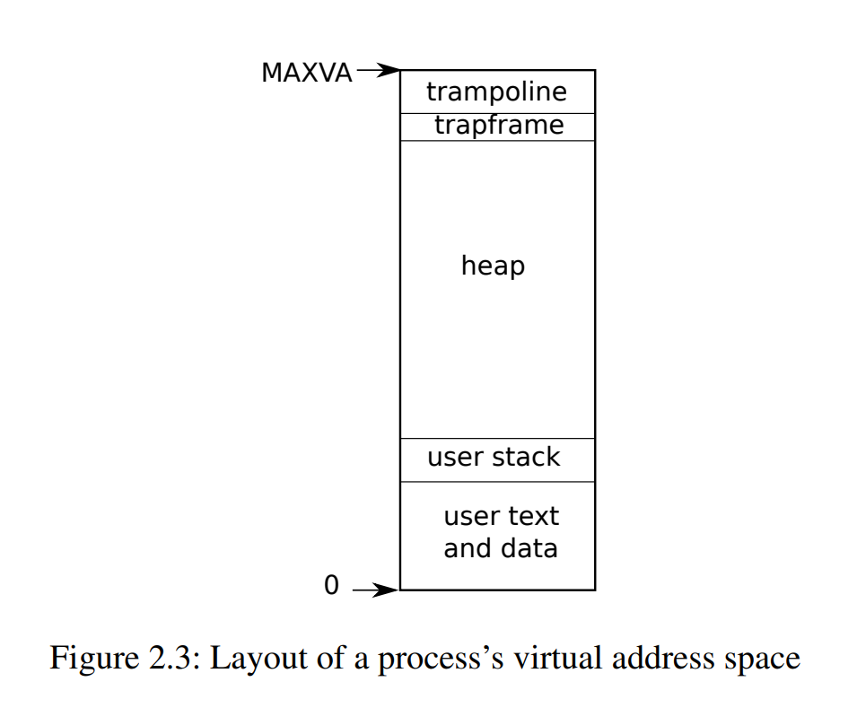
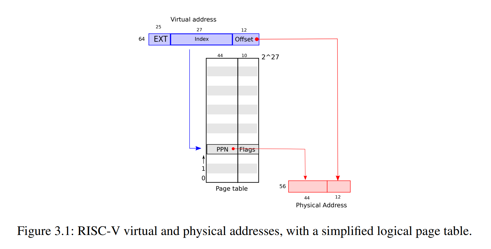
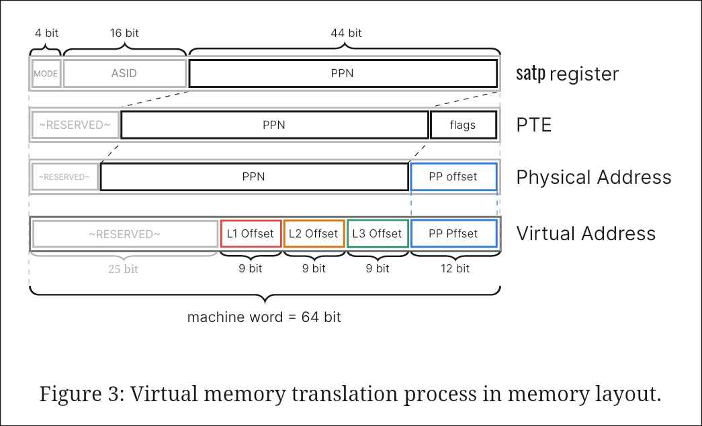
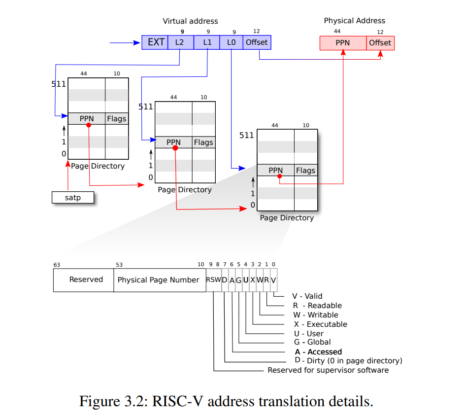
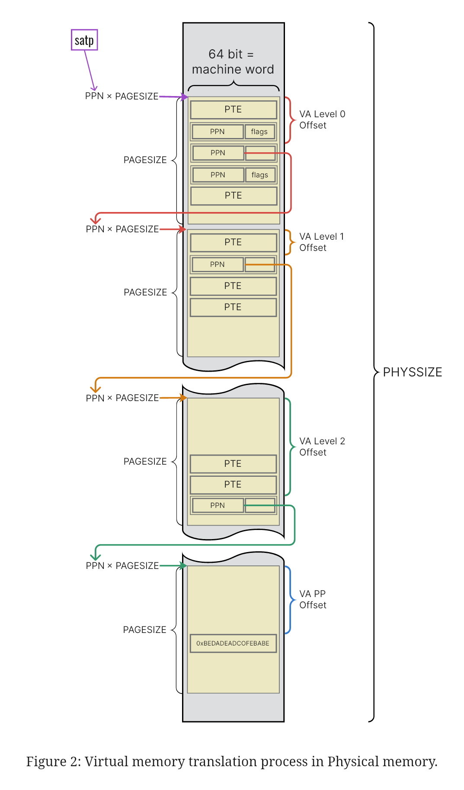
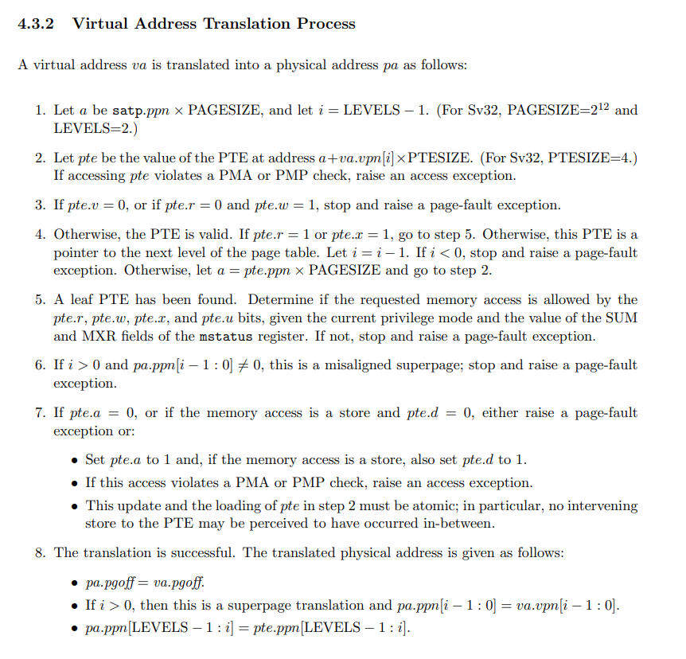
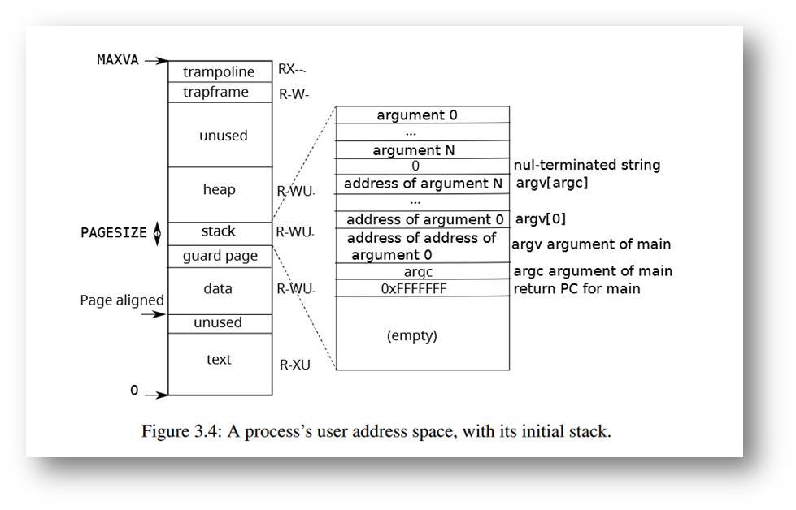

> 18.12.2023-Monday
- - - 

- - - 
Оглавление.

- [[#Введение|Введение]]
	- [[#Введение#Суть виртуальной памяти и ее назначение|Суть виртуальной памяти и ее назначение]]
	- [[#Введение#Архитектура RISC-V|Архитектура RISC-V]]
	- [[#Введение#Операционная система xv6|Операционная система xv6]]
		- [[#Операционная система xv6#xv6-riscv|xv6-riscv]]
	- [[#Введение#Система прерываний и режимы работы процессора|Система прерываний и режимы работы процессора]]
- [[#Устройство виртуальной памяти|Устройство виртуальной памяти]]
- [[#Реализация виртуальная память в RISC-V|Реализация виртуальная память в RISC-V]]
	- [[#Реализация виртуальная память в RISC-V#Общий принцип|Общий принцип]]
	- [[#Реализация виртуальная память в RISC-V#Детальное рассмотрение|Детальное рассмотрение]]
- [[#Использование виртуальной памяти в xv6-riscv|Использование виртуальной памяти в xv6-riscv]]
	- [[#Использование виртуальной памяти в xv6-riscv#Виртуальные адреса|Виртуальные адреса]]
	- [[#Использование виртуальной памяти в xv6-riscv#Обработка прерываний|Обработка прерываний]]
- [[#Другие использования виртуальной памяти в ОС|Другие использования виртуальной памяти в ОС]]
	- [[#Другие использования виртуальной памяти в ОС#Copy-on-Write|Copy-on-Write]]
	- [[#Другие использования виртуальной памяти в ОС#Ленивая аллокация|Ленивая аллокация]]
	- [[#Другие использования виртуальной памяти в ОС#Прямой доступ к памяти и Memory-mapped IO|Прямой доступ к памяти и Memory-mapped IO]]
- [[#Итог|Итог]]
- [[#Ссылки|Ссылки]]

- - -
# Устройство виртуальной памяти RISC-V и как учебная ОС xv6 ее использует

В личном общении я обнаружил что не все хорошо понимают принцип работы виртуальной памяти даже после изучения материалов учебных курсов. В рамках этой статьи я постараюсь связать курсы Операционных систем и Архитектуры компьютера (а так же ЯП, ОПД и др.). Я постараюсь дать детальное понимание представленных в курсах абстракций. Для подготовки использовались учебное пособие по xv6 со спецификацией RISC-V, ну, и указанные курсы.

## Введение

Для начала стоит напомнить основные идеи и определить терминологию которую
будем дальше использовать.  Если вам какой-то следующих разделов абсолютно
понятен, можете пропускать его, ведь здесь мы не буду вдаться в детали.

### Суть виртуальной памяти и ее назначение

Виртуальная память (или *виртуальное адресное пространство*) ― это технология 
управления памятью компьютера, использующаяся в современных процессорных
архитектурах и операционных системах, далее **VM** (Virtual Memory). Мы будем
рассматривать *страничную* VM.  

Виртуальная память применяется для

- увеличения доступного объема памяти,
- изоляции процессов,
- автоматического управления совместным доступом к ресурсам (в том
  числе работа с устройствами)
   
и много чего еще.

Эта технология пришла как альтернатива имевшимся простой сегментной памяти
памяти, и простому пейджингу. Она устраняет недостатки своих предшественников,
но при этом имеет и свои такие, к примеру, как множественное обращение
к памяти для декодирования одного адреса и усложнение архитектуры для
ускорения этих обращений.

В каждом процессе ОС есть определенная разметка VM (Virtual Address Space), которая в общем смысле выглядит примерно так (изображение из xv6-book):

    

<!--  -->

### Архитектура RISC-V

RISC-V ― это современная процессорная архитектура, представитель (не
поверите😲) семейства RISC. 

Эта архитектура является открытой в отличии от ARM (как представителя RISC),
пополняя ряды открытых архитектур MIPS, OpenSPARC и OpenPOWER и др.
RISC-V Foundation занимается разработкой и специфицированием архитектуры.
Открытость архитектуры дает надежды на удешевление процессоров на рынке
и повышение безопасности компьютеров.

К тому же открытость архитектуры позволяет использовать ее как учебное пособие
в университетах.

RISC-V имеет немаленькую историю и, что называется, стоит на плечах гигантов:
берет из имеющихся архитектур хорошие решения и избавляется от их недостатков.
Разумеется, это не универсальное решение, но решение очень многообещающее в свете
возможностей RISC-архитектур показанных Apple.

В данный момент эта архитектура применяется не так широко как другие ― в
основном это встроенные системы и экспериментальные устройства, но есть и рабочие
ЦПУ для ПК. Оттого имеется множество специфицированных версий архитектуры:
Sv32, Sv39, Sv48....  для процессоров разного назначения.

### Операционная система xv6

[Xv6](https://github.com/mit-pdos/xv6-riscv) ― это учебная операционная система разработанная в университете MIT для
обучения студентов основам устройства и разработки операционных систем на курсе
[6.1810: Operating System Engineering](https://pdos.csail.mit.edu/6.1810/2023/index.html).

Xv6 является UNIX-подобной ОС, но POSIX-**не**совместимой, в силу скудного набора
системных вызовов. К ней имеется подробная [документация](https://pdos.csail.mit.edu/6.1810/2023/xv6/book-riscv-rev3.pdf), которую можно использовать
как учебный материал.

#### xv6-riscv

Изначально xv6 была разработана под архитектуру x86, но позже авторы решили
перенести разработку на более простую RISC-V Sv39, т. е. код отвечающий за
низкоуровневую работу ОС был переписан с использованием ассемблера этой
архитектуры. Си-шные обертки можно найти в файле `kernel/riscv.c`.

Поэтому операционная система собирается с помощью специального
riscv-toolchain'а и запускается в эмуляторе `qemu-system-riscv64`.  

### Система прерываний и режимы работы процессора

Система прерываний и режимы работы процессора ― технологии использующиеся в
процессорах в тандеме для повышения надежности и безопасности компьютерных
систем. 

Система прерываний позволяет менять поток выполнения программы на процессоре в
зависимости от внешних условий: таймер сработал, возникла ошибка в программе,
внешнее устройство запросило взаимодействие...

Режимы работы процессора используются для разграничения доступных процессору
инструкций и требующих специальные привилегии. Обычно выделяются 3 режима по
уменьшению привилегированности:

1. машинный $\mathrm{M}$ (Machine),
2. супервайзер $\mathrm{S}$ (Supervisor),
3. и пользовательский $\mathrm{U}$ (User).

Первый позволяет исполнять любые инструкции, последний только безопасные
инструкции. Также могут быть дополнительные режимы, например,  гипервизор
(Hypervisor, для поддержки виртуализации).
Процессор может переключаться между режимами с помощью специальных команд
обеспечивающих безопасность.

Зачастую при обработке прерываний необходимо узнать причину прерывания и
соответствующим образом изменить выполнение программы. Поэтому, если прерывание
происходит в пользовательском режиме, процессор, как правило, переключается в
режим супервайзера, делает свои делишки и возвращается обратно в режим
пользователя. В этот момент важную роль играет виртуальная память, но об далее. 

## Устройство виртуальной памяти

Виртуальная память $\mathrm{VM}$ представляет собой метод превращения
виртуального адреса $\mathrm{VA}$ (Virtual Address) в физический адрес
$\mathrm{PA}$ (Physical Address). 

$$
\mathrm{VM}: \mathrm{VA} \to \mathrm{PA}
$$

При этом стоит учитывать, что 

1. виртуальное адресное пространство много больше, чем доступное физическое,
2. разные процессы могут использовать одинаковые VA,
3. адресация происходит по-байтово,
4. гранулярность памяти для работы с запоминающими устройствами обычно 1 страница (4КБ),
5. нужно иметь возможность устанавливать права доступа к памяти.

Замечу, что под *физическими адресами* понимается по сути любая ячейка для хранения памяти: 
ПЗУ или ОЗУ,  но обычно имеется в виду, что физическая память ― это именно ОЗУ, 
т. к. с ней процессор взаимодействует почти прозрачно, а ПЗУ ― это уже другая память,
с которой взаимодействие происходит через разные устройства, блоками и вообще по разному.

*Страничная* виртуальная память для трансляции использует так называемые "Page Table" 
― таблицы *страниц* $\mathrm{PT}$ сопоставляющие виртуальный адрес с
физическим. В них в каждой записи $\mathrm{PTE}$ (Page Table Entry) содержится
*номер страницы* в физической памяти $\mathrm{PPN}$ (Physical Page Number) и
*флаги доступа* к этой странице. 

Номера физических страниц являются просто порядковыми номерами блока памяти
размером по 1КБ (страницу), считая что они идут непрерывно от самого начала
физической памяти. Поэтому адрес начала физической страницы $\mathrm{PP}$
(Physical Page) можно получить умножив номер страницы на ее размер
$\mathrm{PAGESIZE}$: 

$$
\mathrm{PPN} \times \mathrm{PAGESIZE} = \mathrm{PA}
$$ 

и таким образом виртуальная память представляет собой такое преобразование:

$$
\mathrm{VA} \overset{\mathrm{VM}}{\longmapsto} \mathrm{PPN(PTE_{PT}(VA))}
\times \mathrm{PAGESIZE} = \mathrm{PA},
$$

которое заключающееся в последовательном получении из нужной «таблицы страниц»
нужной записи, получении номера физической страницы из этой записи и получении
физического адреса путём умножения номера на размер страницы. 

Флаги доступа ― просто последовательность бит в PTE кодирующих разные состояния
страницы:

- валидная $V$ (Valid)
- для чтения $R$ (Read),
- для записи $W$ (Write),
- для исполнения $X$ (eXecute),
- для пользователя $U$ (User),
- ...

Стоит отметить, что используется далеко не весь диапазон возможных виртуальных
адресов, т. к. 64 бита слишком много для современных реалий (это несколько
петабайт 🤯), так что последние биты зарезервированы для будущего
использования, как и в PTE есть запасные биты для возможных значений PPN.

## Реализация виртуальная память в RISC-V

### Общий принцип

Примерно так, как описано выше, и устроена виртуальная память в RISC-V: версия
Sv39 является 64 битной использующей только первые 39 бит для виртуального
адреса (поэтому такое называние🔩).  Для навигации по Page Table используются
последние 27 значащих бит VA, первые **12** бит используются для адресации внутри 
физической страницы ($2^{12}= 4096 = \mathrm{PAGESIZE}$ 🤓). Все последние не используемые
биты 64 битного адреса, согласно спецификации, должны иметь значение последнего 
значащего бита адреса. 

Page Table Entry же в Sv39 занимает 54 бита: 10 бит для флагов доступа +
**44** бит для хранения PPN ($2^{44}$ страниц физической памяти можно
адресовать 😵).

Вот таким макаром из 39 бит виртуального адреса можно составить физический
адрес из 44+12 бит (⇌ 64 Пета Байт 💀). 

Схематично описанное можно представить так (из xv6-book):

    

<!--  -->

Тут стоит отметить, что для каждого процесса в ОС есть своя PT, 
ведь у них могут быть одинаковые VA которые должны вести на разные PA.
То, как сопоставляются PT и процессы, мы увидим дальше.

### Детальное рассмотрение

Теперь, углубляясь в детали, стоит сказать, что Page Table на деле состоит из
нескольких уровней, увеличивающих гибкость настройки трансляции адресов. Это
присуще всем современным архитектурам. Конкретно Sv39, которую мы
рассматриваем, состоит из 3-х уровней, но в более сложных версиях их может быть
и больше.

Уровни называются каталогами страниц $\mathrm{PD}$ (Page Directory) и
представляют собой такие же PT, только они ограничиваются размером в 1
страницу. PD содержат 512 таких же 64-битных Page Table Entries 
($512 \times 64 = \mathrm{PAGESIZE}$ ☝), хранящих 44-битный Physical Page Number и флаги
доступа. Для адресации по PD, т. е. выбора нужной PTE, достаточно 9 бит 
($2^{9}= 512$ ⚙). 

Графически размещение значений в памяти можно представить так (моё художество):

    

<!--  -->

Дальше в дело вступает конструкция процессора: получая виртуальный адрес, он
достает из него по очереди номер PTE для каждого уровня PD. С помощью PTE можно
найти номер следующей по уровню страницы, в которой будет либо новая PD, либо
страница с нужным PA. В зависимости от состояния PTE, т. е. флагов доступа,
процессор определяет, какого вида эта страница:

- в любом случае страница должна быть валидна (V),
- для PD флаги RWX должны быть 0, 
- для страницы данных флаги RWX должны быть в определенной спецификацией комбинации (Table 4.4: Encoding of PTE R/W/X fields).

С получением PA из PD разобрались, но как получить самую первую (корневую) PD?

Для этого в RISC-V процессорах есть специальный регистр `satp`, хранящий номер страницы PPN корневой
PD для исполняющегося процесса (всё довольно
просто, ничего хитрого 🧐). В нем хранится режим $\mathrm{MODE}$ в котором работает 
трансляция, PPN и еще кое-что по мелочи (см. схему выше).

Иллюстративно это можно представить так (из xv6-book):

    

<!--  -->

или так, обращая внимание на то, что Page Table это всего лишь набор физических страниц памяти (моё художество):

    

<!--  -->

Режима для Sv39 по большому счёту два:

- трансляция с 3 уровнями ($\mathrm{MODE}=8$)
- и без трансляции ($\mathrm{MODE}=0$).

Без трансляции VA соответствует ровно такому же PA.  Это нужно, чтобы можно
было получить доступ к любой ячейке физической памяти, например, в ядре ОС.

Таким образом, процесс трансляции сводится к 3 итерациям получения физического
адреса страницы из нужного PTE в PD, начиная с той, на которую указывает `satp`.

В спецификации процесс трансляции описывается следующим образом:

    

<!--  -->

(Довольно простое устройство, не правда ли 🤭? Ускорение трансляции устроено куда
сложнее...)

Стоит отметить, что по спецификации любые ошибки в организации PT влекут
page-fault exception («отказ страницы»), который по всем правилам обрабатывается системой
прерываний. Например, страницы в памяти должны быть выравнены по 4096 байт, в противном случае
обращение к такой повлечёт page-faul. 

Также Sv39 поддерживает так называемые «Суперстраницы», т. е. страницы большего
размера чем 4096 байт: 1 МБ «megapage» и 1ГБ «gigapage». Для их поддержки 
используется меньше уровней PD: на очередной итерации сразу находится валидная
страница с не нулевыми флагами RWX, отсюда и такие у них размеры (элегантное решение ☕).
Кстати сказать, они тоже должны быть выравнены, но уже по границе своего размера.

## Использование виртуальной памяти в xv6-riscv 

Xv6 использует виртуальную память в соответствии со спецификацией. При запуске
ОС для ядра отключается трансляция путем записывания `0` в регистр `satp` ―
пользовательские процессы же используют виртуальную память (см. [kernel/start.c](https://github.com/mit-pdos/xv6-riscv/blob/f5b93ef12f7159f74f80f94729ee4faabe42c360/kernel/start.c#L34)).

В xv6 имеется файл с кодом, отвечающим за работу с виртуальной памятью ― `kernel/vm.c`.  
В нем есть функции размечающие специальным образом адреса в Page Table каждого
процесса, функции для манипуляции содержимым памяти и пр. 

Функция `walk(pagetable, va, alloc)` отвечает за поиск физического адреса в PT
по его VA в памяти процесса. Она делает 3 обращения к памяти так, как это делал
бы процессор. Поэтому дополнительная разметка VM может замедлять работу
программ, а само по себе использование виртуальной память не так сильно бьёт по
производительности, когда всю трансляцию выполняет схемотехника процессора.

### Виртуальные адреса

В xv6 существуют специальные виртуальные адреса. Какие-то из них связаны с
эмулятором в котором запускается ОС, какие-то с алгоритмом работы ЦПУ, какие-то
с архитектурными особенностями ОС.

Qemu запускает ОС считая, что код ядра находится по адресу `0x80000000`, а всё,
что ниже, отводится под память устройств. Поэтому в xv6 весь код ядра
загружается после этого адреса.

Иллюстрация разметки VA в ядре (из xv6-book):

    

<!--  -->

Как можно заметить на иллюстрации, в VM существуют так называемые Guard page.
Это буквально страницы виртуальной памяти, которые размечены как не валидные
без любых прав доступа. Они нужны, чтобы предотвратить нелегальный выход за
границу допустимых адресов: при адресации к ним в процессоре возникнет
page-fault исключение. Такое решение более чем оправданно, ведь виртуальных
адресов достаточно много и для разметки целой страницы достаточно изменить
одну запись PTE.

Еще среди специальных виртуальных адресов xv6 можно выделить «trampoline» и
«trapframe». Это специально размеченные страницы в самом конце VM работающие
как код обработчика прерываний и вектор прерываний (почти как в БЭВМ) соответственно. 

Иллюстрация размещения VA в пользовательском процессе (из xv6-book):

    

<!--  -->

### Обработка прерываний

При возникновении прерывания процессор сам переходит по заранее известному
адресу обработчика (trampoline) со всеми вытекающими последствиями.
При этом не происходит смены значения регистра `satp` ― это сделано для оптимизации
производительности прерывания (см. xv6-book главу 4.1 RISC-V trap machinery). 
Так что код должен продолжить безопасно выполняться независимо от того, 
в ядре произошло прерывание или в пользовательском процессе независимо от 
разметки остальной VM ― именно поэтому trampoline размаплен и там и там.

За счет того, что Page Table определяется состоянием регистра, получается возможным
создавать ОС разделения времени путем сохранения состояния процесса, а именно
регистров исполняющего его процессора (ядра, CPU), в вектор прерываний (trapframe).
Таким образом обрабатывая прерывание по таймеру, можно осуществлять распределение
процессов по процессорам.

## Другие использования виртуальной памяти в ОС

Разумеется, применения виртуальной памяти не ограничиваются описанными до этого.
Связку виртуальная память, система прерываний, режимы работы процессора можно
использовать для реализации очень интересных схем работы с памятью.

### Copy-on-Write

Техника Copy-on-Write (CoW 🐄) или «копирование при записи» позволяет сэкономить
физическую память при создании новых процессов: новая страница физической
памяти аллоцируются только тогда, когда становится необходимо изменить данные в
ней, до этого момента одна физическую страница может быть размечена в VM разных процессов.
Реализуется это за счет манипуляции флагом записи W на общие для процессов
страницы и обработки page-fault исключения при попытке записи в неё.

### Ленивая аллокация

Ленивая аллокация тоже позволяет сэкономить физическую память, например, в тех
случаях, когда процесс попросил у операционной системы больше памяти, чем ему
сейчас нужно. В такой ситуации операционная система берет на себя
ответственность за своевременную аллокацию памяти. И реализовать это можно так
же, через обработку page-fault исключения и правильную разметку Page Table. 

### Прямой доступ к памяти и Memory-mapped IO

Еще одно интересное применение VM заключается в представлении в ней данных,
которые находятся совершенно в другом месте, например, в файле или в регистрах
какого-то устройства.

ОС может организовать ввод-вывод данных таким образом, чтобы они не проходили
дополнительных стадий буферизации и записывались прямиком в оперативную память
или память устройств по физическому адресу, сопоставленному с нужным VA. 
Так в общих чертах работает «прямой доступ к памяти» (Direct Memory Access) и Memory-mapped IO.
(Случайный доступ к памяти файла так происходит значительно быстрее, чем через `lseek`, `fseek` 😎)
Можно вспомнить, как в курсе ЯПов была лаба на написание своего аллокатора памяти 
работавшего через системный вызов `mmap`.

## Итог

В рамках этой статьи мы рассмотрели устройство виртуальной памяти и способы ее
использования на примере учебной операционной системы xv6 на платформе RISC-V.
Надеюсь было очень полезно и информативно. Теперь абстракция
виртуальной памяти не должна вызывать трудностей в понимании принципов ее работы.

## Ссылки

Ссылки на источники:

- Спецификация RISC-V ― https://riscv.org/wp-content/uploads/2017/05/riscv-privileged-v1.10.pdf
- Учебное пособие по xv6 ― https://pdos.csail.mit.edu/6.828/2023/xv6/book-riscv-rev3.pdf
- Репозиторий с исходными кодами xv6 ― https://github.com/mit-pdos/xv6-riscv
- Запись доклада на JPoint «Владимир Кемпик — JVM для RISC-V / Syntacore» ― https://youtu.be/_v7ddWj8buk
- Шпаргалка по кодам исключений в RISC-V ― https://dram.page/riscv-trap/

Дополнительные интересные ссылки:

- Запись доклада представителя Selectel про будущее ARM (и RISC) ― https://youtube.com/live/iJ-WJsRYCVU?t=18
- Репозиторий небольшой Unix-подобной RTOS (подойдет для изучения) ― https://github.com/embox/embox
- Запись доклада «За гранью Intel и Linux – необычные процессоры и операционные системы –
  Дмитрий Завалиш» ― https://youtu.be/DBOTcG6iJEI
- Серия статей про Lockfree структуры данных во всех деталях ― https://habr.com/ru/users/khizmax/publications/articles/
- Запись доклада «Архитектура процессора Эльбрус 2000 / Дмитрий Завалишин» ― https://youtu.be/6SZZ7ASOR7s

P.S. Мои рисунки сделаны в Pixso

- - -
Flags

[[--Studying]] [[--Graphics]] [[--Algorithms]] [[--Concurrency]] [[--Architecture]]

- - - 
Links
[[xv6]] [[articles/xv6-riscv/Как xv6 использует RISC-V процессор|Как xv6 использует RISC-V процессор]] [[Архитектура компьютера ЛР 1 (Доклад) ]][[CS/langs/c-like/C/C|C]] [[qemu]] [[VM]]
