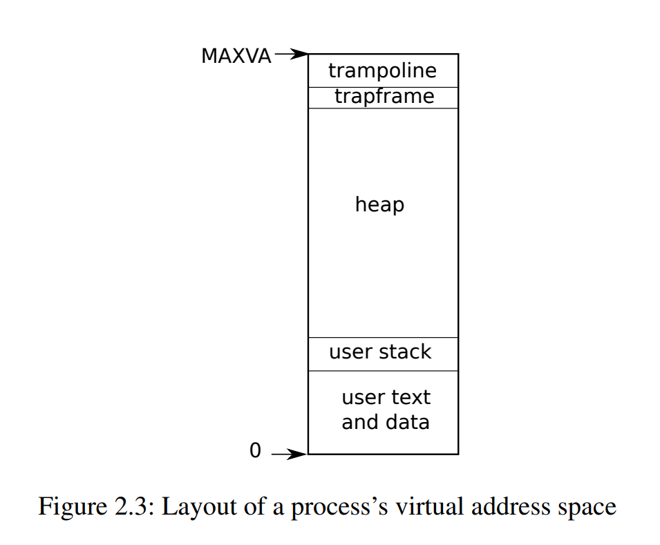
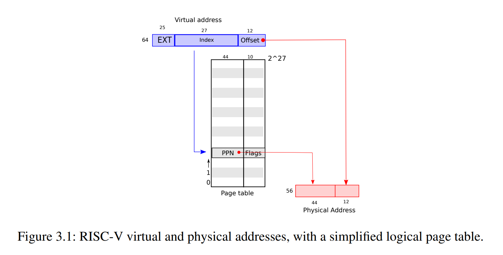
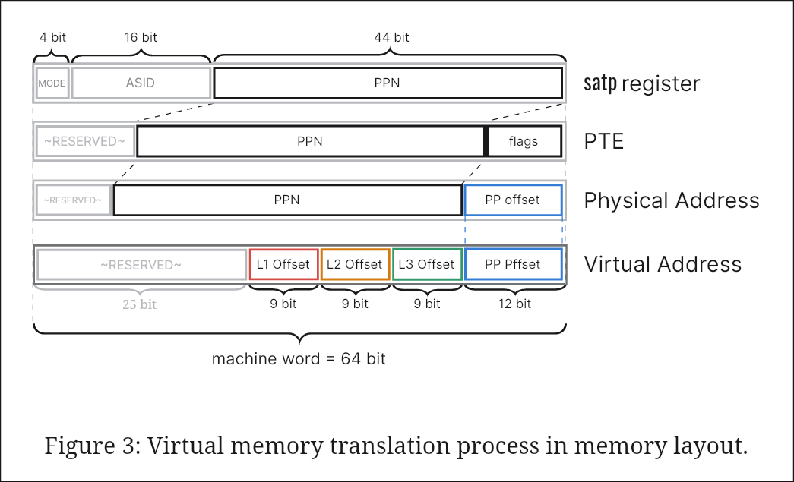
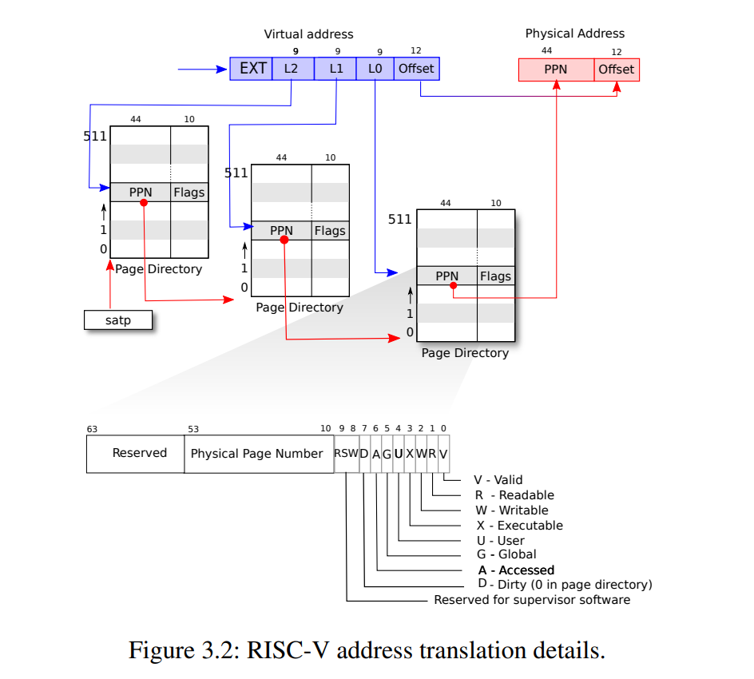
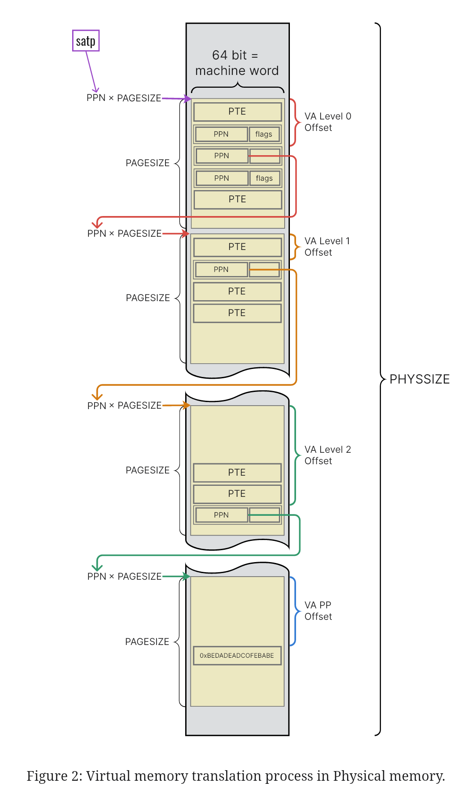
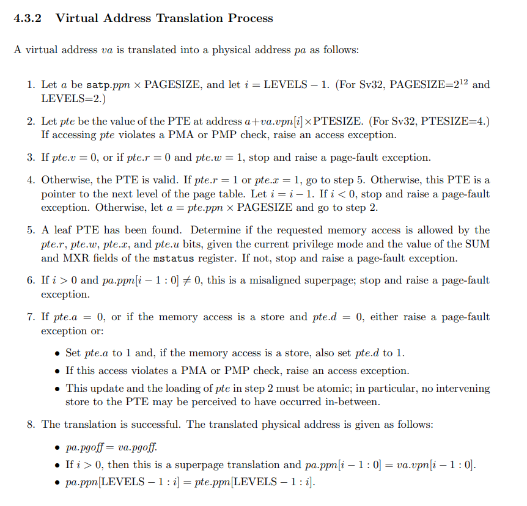
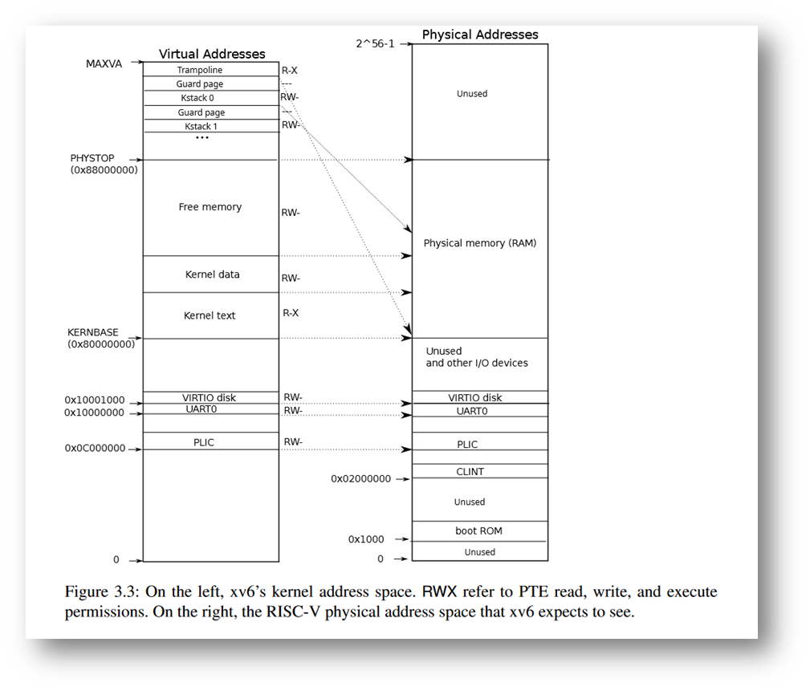
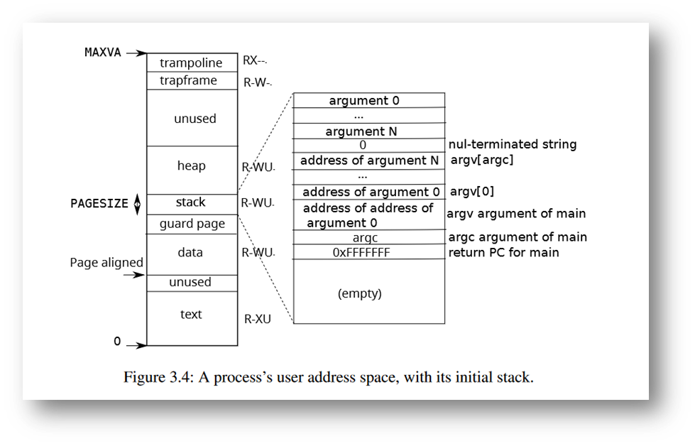

# Принцип работы виртуальной памяти RISC-V и как учебная ОС xv6 ее использует

Архитектура компьютера и принципы работы операционных систем настолько тесно
связаны, что изучаются как правило вместе. Одной из точек преткновения в их изучении
становится виртуальная память — развитая технология, неотличимая от магии.
Опыт приёма лаб у студентов показал, что многие так и не разобрались с тем, как она
работает, хотя вся необходимая информация у них есть: остается связать всё воедино.
Давайте посмотрим, как из простых вещей получается виртуальная память и как
научить операционную систему с ней работать.

- - -

## Оглавление

1. [Введение](#intro)
	1. [Суть виртуальной памяти и ее назначение](#vm-basics)
	2. [Архитектура RISC-V](#riscv-basics)
	3. [Операционная система xv6](#xv6-basics)
	4. [Система прерываний и режимы работы процессора](#interrupts-and-cpu-modes)
2. [Устройство виртуальной памяти](#vm-construction)
3. [Реализация виртуальная память в RISC-V](#vm-ricv-implementation)
	1. [Общий принцип](#vm-riscv-general)
	2. [Детальное рассмотрение](#vm-riscv-detailed)
4. [Использование виртуальной памяти в xv6-riscv](#xv6-riscv-vm-usage)
	1. [Виртуальные адреса](#xv6-riscv-va)
	2. [Обработка прерываний](#xv6-riscv-interrupts)
5. [Другие применения виртуальной памяти в ОС](#vm-another-usages)
	1. [Copy-on-Write](#vm-cow)
	2. [Ленивая аллокация](#vm-lazy-allocation)
	3. [Прямой доступ к памяти и Memory-mapped IO](#vm-dma-and-memory-mapped-io)
6. [Итог](#results)
7. [Ссылки](#references)

- - -

## Введение
<anchor>intro</anchor>

Сам я не являюсь экспертом в вопросе устройства операционных систем и
процессоров, тем не менее я изучил множество открытых источников информации в
интернете, прошел несколько учебных курсов, прочитал спецификации и
документации. Я решил собрать информацию в одном месте, чтобы в следующем
учебном году ссылаться на неё и дать необходимые детальки к пониманию технологии.

В этой статье виртуальная память будет объясняться на примере ныне популярной
процессорной архитектуры RISC-V, а так же будут привлекаться материалы связанные
с учебной операционной системой xv6, так как считаю их достаточно
иллюстративными.

Для начала стоит напомнить основные идеи и определить терминологию которую
будем дальше использовать. Если вам какой-то следующих разделов введения
абсолютно понятен, можете пропускать его, ведь здесь мы не будем вдаваться в
детали.

### Суть виртуальной памяти и ее назначение
<anchor>vm-basics</anchor>

Виртуальная память (или *виртуальное адресное пространство*) ― это технология
управления памятью компьютера, использующаяся в современных процессорных
архитектурах и операционных системах, далее **VM** (Virtual Memory). Мы будем
рассматривать __страничную__ VM, есть еще другие виды, например, сегментная или
сегментно-страничная, но нас они сегодня не интересуют, их устройство отличается,
но принцип в сущности тот же.

Виртуальная память применяется для

- увеличения доступного объема памяти процессов (и потоков) в ОС,
- изоляции процессов (и потоков),
- автоматического управления совместным доступом к ресурсам (в том числе устройствам)

и много чего еще.

Эта технология пришла как альтернатива имевшимся простой сегментной памяти
памяти, и простому пейджингу. Она устраняет недостатки своих предшественников,
но при этом имеет и свои. 

<!-- такие, к примеру, как множественное обращение к памяти
для декодирования одного адреса и усложнение архитектуры для ускорения этих
обращений. -->

Виртуальная память каждого процесса операционной системы следует определенной
разметке и создает виртуальное адрессное пространство (Virtual Address Space),
то есть набор доступных адресов "ячеек" виртуальной памяти.
Такая разметка в общем смысле выглядит так (изображение из xv6-book):

Тут важно, что адреса распологаются от 0 до какого-то максимального виртаульного адреса MAXVA, среди них есть кусочек отвечающий за исполняющийся програмный код, стек, область кучи (heap) доступной для свободного использования и еще разные другие вспомогательные участки.

### Архитектура RISC-V
<anchor>riscv-basics</anchor>

«RISC-V» ― это современная процессорная архитектура, представитель (не
поверите 😲) семейства RISC.

Эта архитектура набора команд является открытой в отличии от ARM (как
представителя RISC) и пополнет ряды других открытых архитектур таких, как MIPS,
OpenSPARC, OpenPOWER и пр. Её разработкой и специфицированием занимается
организация RISC-V Foundation и ещё множетсво других во всём мире. Главное её преимущество — открытость и расширяемость, а ещё наглядность, что
позволяет успешно использовать ее как учебное пособие.

RISC-V имеет немаленькую историю и, что называется, стоит на плечах гигантов:
берет из имеющихся архитектур хорошие решения и избавляется от их недостатков.
В данный момент эта архитектура применяется не так широко как другие ― в
основном это встроенные системы и экспериментальные устройства, но есть и
рабочие экземпляры ЦПУ для ПК. Оттого имеется множество специфицированных версий
архитектуры: Sv32, Sv39, Sv48 и различные их расширения [4] для процессоров
разного назначения.

### Операционная система xv6
<anchor>xv6-basics</anchor>

[Xv6](https://github.com/mit-pdos/xv6-riscv) ― это учебная операционная система
разработанная в университете MIT для обучения студентов основам работы и
разработки операционных систем.

Xv6 является UNIX-подобной ОС, но POSIX-**не**совместимой в силу скудного
набора системных вызовов. К ней прилагается подробная документация
[xv6-book](https://pdos.csail.mit.edu/6.1810/2023/xv6/book-riscv-rev3.pdf),
которую можно использовать как учебный материал.

Изначально xv6 была разработана под архитектуру x86, но позже авторы решили
перенести разработку на более понятную RISC-V Sv39, т.е. код отвечающий за
низкоуровневую работу ОС был переписан с использованием ассемблера этой
архитектуры. Си-шные обертки над ассемблером можно найти в файле
`kernel/riscv.c`. Операционная система собирается с помощью специального
riscv-toolchain'а и запускается в эмуляторе `qemu-system-riscv64`.

### Система прерываний и режимы работы процессора
<anchor>interrupts-and-cpu-modes</anchor>

Система прерываний и режимы работы процессора ― технологии использующиеся в
процессорах в тандеме для повышения надежности и безопасности компьютерных
систем.

Система прерываний позволяет менять поток выполнения программы на процессоре в
зависимости от внешних условий: таймер сработал, возникла ошибка в программе,
или произошел системный вызов, внешнее устройство запросило взаимодействие и
пр. Виды прерываний в процессоре специфицированы, и понять, какое прерывание
произошло, можно по значению [5] в специальном регистре.

Режимы работы процессора используются для разграничения доступных процессору
инструкций и требующих специальные привилегии. Обычно выделяются 3 режима по
уменьшению привилегированности:

1. машинный (Machine),
2. супервайзер (Supervisor),
3. и пользовательский (User).

Первый позволяет исполнять любые инструкции, последний только безопасные
инструкции. Также могут быть дополнительные режимы, например,  гипервизор
(Hypervisor, для поддержки виртуализации). Процессор может переключаться между
режимами с помощью специальных команд, обеспечивающих безопасность.

Зачастую при обработке прерываний необходимо узнать причину прерывания и
соответствующим образом изменить выполнение программы. Поэтому, если прерывание
происходит в пользовательском режиме, процессор, как правило, переключается в
режим супервайзера, делает свои делишки и возвращается обратно в режим
пользователя. В этот момент важную роль играет виртуальная память, но об далее.

## Устройство виртуальной памяти
<anchor>vm-construction</anchor>

Виртуальная память $\mathrm{VM}$ представляет собой метод превращения
виртуального адреса $\mathrm{VA}$ (Virtual Address) в физический адрес
$\mathrm{PA}$ (Physical Address). Используя некоторый формализм, это можно
изобразить так:

$$
\mathrm{VM}: \mathrm{VA} \to \mathrm{PA}
$$

При этом стоит учитывать, что

1. виртуальное адресное пространство много больше, чем доступное физическое,
2. разные процессы могут использовать одинаковые VA,
3. адресация происходит по-байтово,
4. гранулярность памяти для работы с запоминающими устройствами обычно 1 страница (4КБ),
5. нужно иметь возможность устанавливать права доступа к памяти.

Замечу, что под *физическими адресами* понимается по сути любая ячейка для
хранения памяти: ПЗУ или ОЗУ,  но обычно имеется в виду, что физическая память
― это именно ОЗУ, т.к. с ней процессор взаимодействует почти прозрачно, а ПЗУ
― это уже другая память, с которой взаимодействие происходит через разные
устройства, блоками и вообще по разному. Виртуальная память же позволяет скрыть
эту разницу.

*Страничная* виртуальная память для трансляции использует так называемые "Page
Tables" ― таблицы *страниц* $\mathrm{PT}$ сопоставляющие виртуальный адрес с
физическим. В них в каждой записи $\mathrm{PTE}$ (Page Table Entry) содержится
*номер страницы* в физической памяти $\mathrm{PPN}$ (Physical Page Number) и
*флаги доступа* к этой странице.

Номера физических страниц являются просто порядковыми номерами блоков памяти
размером по 4КБ, считая что они идут непрерывно от самого начала физической
памяти. Поэтому адрес начала физической страницы $\mathrm{PP}$
(Physical Page) можно получить умножив номер страницы на ее размер
$\mathrm{PAGESIZE}$, вот так:

$$
\mathrm{PPN} \times \mathrm{PAGESIZE} = \mathrm{PA},
$$

и таким образом виртуальная память представляет собой такое преобразование:

$$
\mathrm{VA} \overset{\mathrm{VM}}{\longmapsto} \mathrm{PPN(PTE_{PT}(VA))}
\times \mathrm{PAGESIZE} = \mathrm{PA},
$$

которое заключается в последовательном получении из нужной таблицы страниц PT
нужной записи для данного виртауального адреса
$va\mapsto\mathrm{PTE_{PT}}(va)$, получении номера физической страницы из этой
записи $pte\mapsto\mathrm{PPN}(pte)$ и получении физического адреса путём
умножения номера на размер страницы.

Флаги доступа ― просто последовательность бит в PTE кодирующих разные состояния
страницы:

- валидная $V$ (Valid)
- для чтения $R$ (Read),
- для записи $W$ (Write),
- для исполнения $X$ (eXecute),
- для пользователя $U$ (User),
- ...

Стоит отметить, что используется далеко не весь диапазон возможных виртуальных
адресов, т.к. 64 бита слишком много для адресации в современных реалиях (это
много петабайт 😵), так что последние биты зарезервированы для будущего
использования, как и в PTE есть запасные биты для возможных значений PPN и
флагов.

## Реализация виртуальная память в RISC-V
<anchor>vm-ricv-implementation</anchor>

### Общий принцип
<anchor>vm-riscv-general</anchor>

Примерно так, как описано выше, и устроена виртуальная память в RISC-V: версия
Sv39 является 64 битной, использующей только первые 39 бит для виртуального
адреса, отсюда и такое называние.  Для навигации по Page Table используются
последние 27 значащих бит VA, первые **12** бит используются для адресации
внутри физической страницы ($2^{12}= 4096 = \mathrm{PAGESIZE}$ 🤓). Все
последние не используемые биты 64 битного адреса, согласно спецификации, должны
иметь значение последнего значащего бита адреса, а отсюда появляется диапазон
априори невалидных адресов.

Page Table Entry же в Sv39 занимает 54 бита: 10 бит для флагов доступа + **44**
бит для хранения PPN ($2^{44}$ страниц физической памяти можно адресовать 🤯),
но занимает она так же 64 бита — выравнивание.

Вот таким макаром из 39 бит виртуального адреса можно составить физический
адрес из 44+12 бит (⇌ 64 Пета Байт 💀).

Схематично описанное можно представить так (из xv6-book):

Тут стоит отметить, что для каждого процесса в ОС есть своя PT, ведь у них
могут быть одинаковые VA которые должны вести на разные PA. То, как
сопоставляются PT и процессы, мы увидим дальше.

### Детальное рассмотрение
<anchor>vm-riscv-detailed</anchor>

Теперь, углубляясь в детали, стоит сказать, что Page Table на деле состоит из
нескольких уровней, увеличивающих гибкость настройки трансляции адресов. Это
присуще всем современным архитектурам. Конкретно Sv39, которую мы
рассматриваем, состоит из 3-х уровней, но в более сложных версиях их может быть
и больше.

Уровни называются каталогами страниц $\mathrm{PD}$ (Page Directory) и
представляют собой такие же PT, только они ограничиваются размером в 1
страницу. PD содержат 512 таких же 64-битных Page Table Entries ($512 \times 64
= \mathrm{PAGESIZE}$ 🔩), хранящих 44-битный Physical Page Number и флаги
доступа. Для адресации по PD, т.е. для выбора нужной PTE, достаточно 9 бит
($2^{9}= 512$ ⚙).

Графически размещение значений в памяти можно представить так (моё художество):

Дальше в дело вступает конструкция процессора: получая виртуальный адрес, он
достает из него по очереди номер PTE для каждого уровня PD. С помощью PTE можно
найти номер следующей по уровню страницы, в которой будет либо новая PD, либо
страница с нужным PA. В зависимости от состояния PTE, т. е. флагов доступа,
процессор определяет, какого вида эта страница:

- в любом случае страница должна быть валидна (V),
- для PD флаги RWX должны быть 0,
- для страницы данных флаги RWX должны быть в определенной спецификацией
  комбинации (Table 4.4: Encoding of PTE R/W/X fields).

С получением PA из PD разобрались, но как получить самую первую (корневую) PD?

Для этого в RISC-V процессорах есть специальный регистр `satp`, хранящий номер
страницы PPN корневой PD для исполняющегося процесса (никакой хитрости 🧐). В
нем хранится режим $\mathrm{MODE}$ в котором работает трансляция, PPN и еще
кое-что по мелочи (см. схему выше).

Иллюстративно это можно представить так (из xv6-book):

или так, обращая внимание на то, что Page Table это всего лишь набор физических страниц памяти (моё художество):

Режима для Sv39 по большому счёту два:

- трансляция с 3 уровнями ($\mathrm{MODE}=$`0x8`)
- и без трансляции ($\mathrm{MODE}=$`0x0`).

Без трансляции VA соответствует ровно такому же PA.  Это нужно, чтобы можно
было получить доступ к любой ячейке физической памяти, например, в ядре ОС.

Таким образом, процесс трансляции сводится к 3 итерациям получения физического
адреса страницы из нужного PTE в PD, начиная с той, на которую указывает
`satp`.

В спецификации процесс трансляции описывается текстом и весь алгоритм умещается
на одном листе, и оперируют в нем уже рассмотренными нами терминами (прочтение
и осознание алгоритма остается Вам в качестве упражнения!):

(Довольно простой алгоритм, не правда ли 🤭? Ускорение трансляции устроено куда
сложнее...)

Стоит отметить, что по спецификации любые ошибки в организации PT влекут
page-fault exception (исключение «отказ страницы»), который по всем правилам
обрабатывается системой прерываний. Например, страницы в памяти должны быть
выравнены по 4096 байт, в противном случае обращение к такой повлечёт
page-fault.

Также Sv39 поддерживает так называемые «Суперстраницы», т. е. страницы большего
размера чем 4096 байт: 1 МБ «megapage» и 1ГБ «gigapage». Для их поддержки
используется меньше уровней PD: на очередной итерации сразу находится валидная
страница с не нулевыми флагами R/W/X, отсюда и такие у них размеры (элегантное
решение ☕). Кстати сказать, они тоже должны быть выравнены, но уже по границе
своего размера.

## Использование виртуальной памяти в xv6-riscv
<anchor>xv6-riscv-vm-usage</anchor>

Xv6 использует виртуальную память в соответствии со спецификацией. При запуске
ОС для ядра отключается трансляция путем записывания `0` в регистр `satp` ―
пользовательские процессы же используют виртуальную память (см.
[kernel/start.c](https://github.com/mit-pdos/xv6-riscv/blob/f5b93ef12f7159f74f80f94729ee4faabe42c360/kernel/start.c#L34)).

В xv6 функции, отвечающим за работу с виртуальной памятью находятся в
[`kernel/vm.c`](https://github.com/mit-pdos/xv6-riscv/blob/riscv/kernel/vm.c).
В нем есть функции размечающие специальным образом адреса в Page Table каждого
процесса, функции для манипуляции содержимым памяти и пр.

Функция `walk(pagetable, va, alloc)`
([kernel/vm.c#L86](https://github.com/mit-pdos/xv6-riscv/blob/de247db5e6384b138f270e0a7c745989b5a9c23b/kernel/vm.c#L86))
отвечает за поиск физического адреса в PT по его VA в памяти процесса. Она
делает 3 обращения к памяти так, как это делал бы процессор. Поэтому
дополнительная разметка VM может замедлять работу программ, а само по себе
использование виртуальной память не так сильно бьёт по производительности,
когда всю трансляцию выполняет схемотехника процессора.

### Виртуальные адреса
<anchor>xv6-riscv-va</anchor>

В xv6 существуют специальные виртуальные адреса. Какие-то из них связаны с
эмулятором в котором запускается ОС, какие-то с алгоритмом работы ЦПУ, какие-то
с архитектурными особенностями ОС.

Qemu запускает ОС считая, что код ядра находится по адресу `0x80000000`, а всё,
что ниже, отводится под память устройств. Поэтому в xv6 весь код ядра
загружается после этого адреса.

	
Из забавного не документированного

    адрес `0x100000` может быть использован, чтобы [выключить
    эмулятор](https://unix.stackexchange.com/a/758201) – нужно просто записать
    туда `0x5555`.

Иллюстрация разметки VA в ядре (из xv6-book):

Как можно заметить на иллюстрации, в VM существуют так называемые Guard page.
Это буквально страницы виртуальной памяти, которые размечены как невалидные
без любых прав доступа. Они нужны, чтобы предотвратить нелегальный выход за
границу допустимых адресов: при адресации по ним в процессоре возникнет
page-fault исключение. Такое решение более чем оправданно, ведь виртуальных
адресов достаточно много и для разметки целой страницы достаточно изменить одну
запись PTE.

Еще среди специальных виртуальных адресов xv6 можно выделить «trampoline» и
«trapframe». Это специально размеченные страницы в самом конце VM работающие
как код обработчика прерываний и вектор прерываний соответственно (почти как в
[БЭВМ](https://github.com/tune-it/bcomp) 😏).

Иллюстрация размещения VA в пользовательском процессе (из xv6-book):

### Обработка прерываний
<anchor>xv6-riscv-interrupts</anchor>

При возникновении прерывания процессор сам переходит по заранее известному
адресу обработчика (trampoline) со всеми вытекающими последствиями. При этом не
происходит смены значения регистра `satp` ― это сделано для оптимизации
производительности прерывания (см. xv6-book главу 4.1 RISC-V trap machinery).
Так что код должен продолжить безопасно выполняться независимо от того, в ядре
произошло прерывание или в пользовательском процессе независимо от разметки
остальной VM ― именно поэтому trampoline размаплен и там и там в одном месте.

За счет того, что Page Table определяется состоянием регистра, получается
возможным создавать ОС разделения времени путем сохранения состояния процесса,
а именно регистров исполняющего его процессора (ядра, CPU), в вектор прерываний
(trapframe). Таким образом, обрабатывая прерывание по таймеру, можно
осуществлять распределение процессов (задач) по процессорам (aka ядрам).

## Другие применения виртуальной памяти в ОС
<anchor>vm-another-usages</anchor>

Разумеется, варианты использования виртуальной памяти не ограничиваются
описанными до этого. Связку «виртуальная память, система прерываний, режимы
работы процессора» можно использовать для реализации очень интересных схем
работы с памятью.

### Copy-on-Write
<anchor>vm-cow</anchor>

Техника Copy-on-Write (CoW 🐄) или «копирование при записи» позволяет
сэкономить физическую память при создании новых процессов: новая страница
физической памяти аллоцируются только тогда, когда становится необходимо
изменить данные в ней, до этого момента одна физическую страница может быть
размечена в VM разных процессов. Реализуется это за счет манипуляции флагом
записи W на общие для процессов страницы и обработки page-fault исключения при
попытке записи в неё.

### Ленивая аллокация
<anchor>vm-lazy-allocation</anchor>

Ленивая аллокация тоже позволяет сэкономить физическую память, например, в тех
случаях, когда процесс попросил у операционной системы больше памяти, чем ему
сейчас нужно. В такой ситуации операционная система берет на себя
ответственность за своевременную аллокацию памяти. И реализовать это можно так
же, через обработку page-fault исключения и правильную разметку Page Table.

### Прямой доступ к памяти и Memory-mapped IO
<anchor>vm-dma-and-memory-mapped-io</anchor>

Еще одно интересное применение VM заключается в представлении в ней данных,
которые находятся совершенно в другом месте, например, в файле или в регистрах
какого-то устройства.

ОС может организовать ввод-вывод данных таким образом, чтобы они не проходили
дополнительных стадий буферизации и записывались прямиком в оперативную память
или память устройств по физическому адресу, сопоставленному с нужным VA — так в
общих чертах работает «прямой доступ к памяти» (Direct Memory Access) и
Memory-mapped IO. (Случайный доступ к памяти файла так происходит значительно
быстрее, чем через `lseek`, `fseek` 😎)

## Итог
<anchor>results</anchor>

В рамках этой статьи мы рассмотрели устройство виртуальной памяти и примеры ее
организации и использования на примере учебной операционной системы xv6 на
платформе RISC-V. Надеюсь было очень полезно и информативно. Теперь абстракция
виртуальной памяти не должна вызывать трудностей в понимании принципов ее
работы.

## Ссылки
<anchor>references</anchor>

**Ссылки на источники.**

1. Спецификация RISC-V ― https://riscv.org/wp-content/uploads/2017/05/riscv-privileged-v1.10.pdf.
2. Учебное пособие по xv6 ― https://pdos.csail.mit.edu/6.828/2023/xv6/book-riscv-rev3.pdf.
3. Репозиторий с исходными кодами xv6 ― https://github.com/mit-pdos/xv6-riscv.
4. Запись доклада «Инструменты программирования для открытой архитектуры RISC V
   | Константин Владимиров (SYNTACORE)» — https://youtu.be/qoNjayusCX4.
5. Шпаргалка по кодам исключений в RISC-V ― https://dram.page/riscv-trap.

**Дополнительные интересные материалы.**

6. Запись доклада «За гранью Intel и Linux – необычные процессоры и
   операционные системы – Дмитрий Завалишин» ― https://youtu.be/DBOTcG6iJEI.

